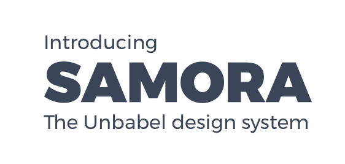

[](https://www.codacy.com/app/unbabel/ui)
[](https://www.codacy.com/app/unbabel/ui)

This is the Unbabel UI (Vue.js) component library AKA Samora.

Contribute in the repository [here](https://github.com/Unbabel/ui)

## Install
Install it using `npm`

```shell
npm i --save @unbabel/ui
```

## Usage
Import the components into your app using:

```javascript
import { Button } from '@unbabel/ui';
```

And set it as a component:
```javascript
components: {
	Button,
},
```

So you can use it in your templates:
```vue
<Button>Click me!</Button>
```

**Or** if you only need the colours for your styles, you can import the .scss file using:

```scss
@import '~@unbabel/ui/src/colors';
```

To use any color variable with custom properties you need to use interpolation

```scss
--color: #{$un-purple};
```

## Components
- Button
- Modal
- TopBar
- Sidebar
- Star Group
- Loading Screen (Overlay)
- Toggle Group
- Timer

## Development
To develop or add new components, install the dependencies and launch the [Storybook](https://storybook.js.org/basics/guide-vue/) server to preview your components:

```shell
$ npm install
$ npm run storybook
```
